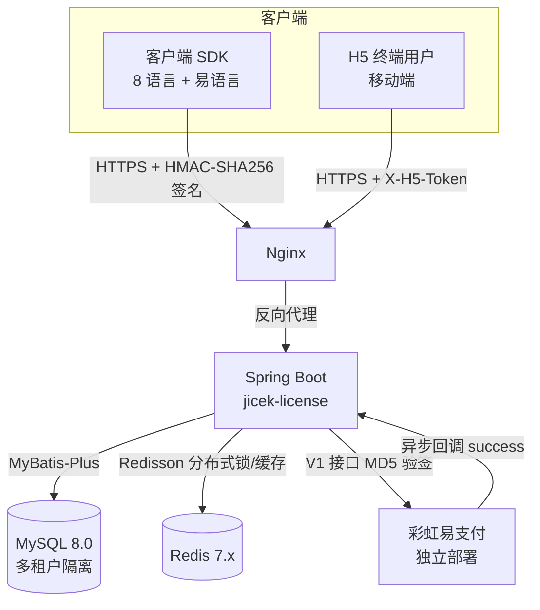
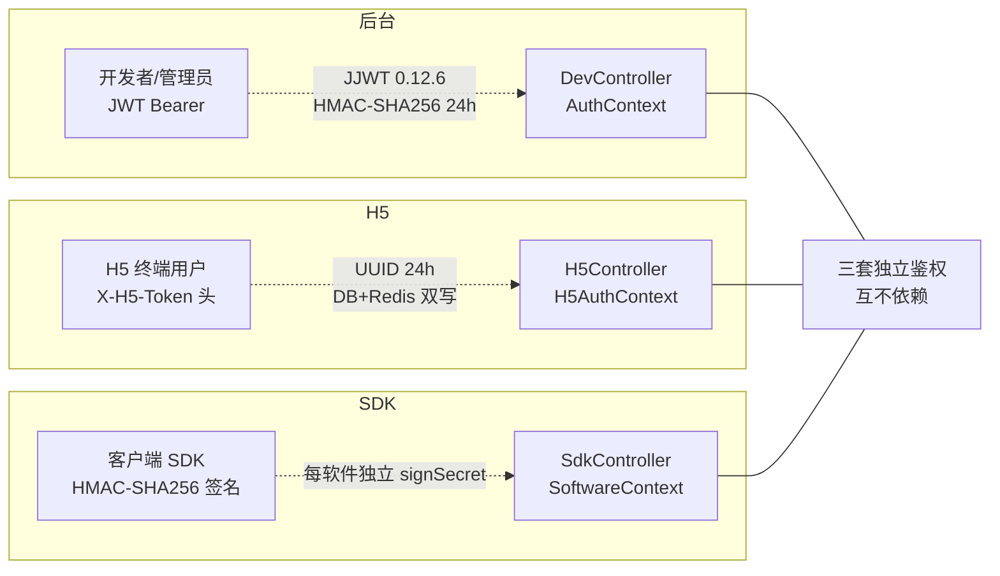
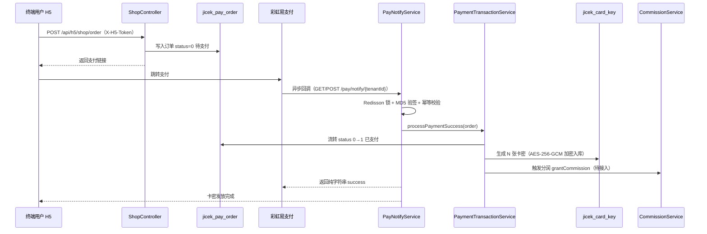
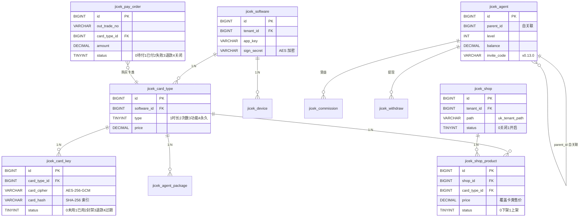
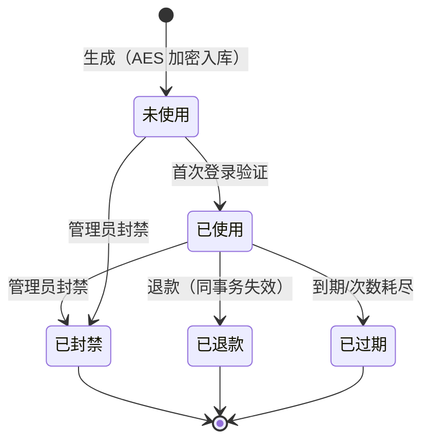

# 极策k网络验证

> 面向开发者的多租户卡密验证 SaaS 平台 · 基于 RuoYi-Vue-Plus 技术栈 · 国产开源可私有部署

[](CHANGELOG.md)
[](#license)
[](https://openjdk.org/)
[](https://spring.io/projects/spring-boot)
[](https://vuejs.org/)

## 项目简介

极策k网络验证是一款面向软件开发者的卡密验证 SaaS 平台，对标护卫盾、科御网络验证等闭源产品，差异化优势：

- **国产开源技术栈**：基于 RuoYi-Vue-Plus，可私有部署、可二次开发
- **真正多租户 SaaS**：MyBatis-Plus 租户隔离，开发者独立数据空间
- **资金合规**：彩虹易支付独立部署，平台不经手资金，规避二清风险
- **8 语言 SDK 全覆盖**：Java / C# / Python / Go / Node.js / C++ / 易语言 / Lua / Shell
- **最前沿加密**：AES-256-GCM + RSA-2048-OAEP + HMAC-SHA256（可选国密 SM2/SM4）

## 当前版本（v0.15.0）

### 已完成 ✅

| 版本 | 主题 | 摘要 |
|---|---|---|
| v0.2.0 | 后端核心模块 | 加密层 + 卡密 + 支付适配 + 资金一致性 + 多租户拦截器 |
| v0.3.0 | 设备指纹与绑定 | 5 维 SHA-256 融合 + 换机码 + 心跳保活 + nonce 防重放 |
| v0.3.1 | 8 语言客户端 SDK | Java/Python/Node.js/Go/C#/C++/Lua/Shell + 易语言，统一契约见 [sdk/README.md](sdk/README.md) |
| v0.4.0 | 多级代理 + 分润 + 提现 | 树形代理 + 链式分润 + 提现状态机（未引入 WarmFlow） |
| v0.4.1 | 前端补全第一批 | 卡类/设备管理 + Dashboard ECharts + StatusTag 扩展 |
| v0.4.2 | 云函数远程执行 | LuaJ 3.0.6 沙箱 + 审计日志不可篡改 |
| v0.4.3 | 数据统计与可视化 | 4 Tab（验证量/设备热力/收入/防破解） |
| v0.5.0 | GitHub 自动更新部署 | Webhook 验签 + Redisson 锁 + 备份回滚 + 健康检查 |
| v0.6.0 / v0.6.1 | 工单系统 | 单向工单（开发者→管理员）+ 状态机 + 审计表 |
| v0.7.0 | 鉴权框架 | JWT（JJWT 0.12.6 HMAC-SHA256）+ @AuthRequired 渐进式 + AuthContext |
| v0.8.0 | 软件模块 | CRUD + 密钥生成/轮换 + 关联校验 |
| v0.9.0 | SDK 模块 | SdkAuthFilter 签名鉴权 + 卡密登录 + SoftwareContext |
| v0.10.0 | 公告模块 | CRUD + 发布/下线状态机 + SDK 拉取 + 版本范围匹配 |
| v0.11.0 | 自动更新包 | 文件上传 + CRUD + 发布/下线 + 多格式 exe/sh/win/lua/zip/7z |
| v0.12.0 | SDK 代码生成器 + 对接文档 | 9 语言模板一键生成 + 对接文档页（纯前端） |
| v0.13.0 | H5 验证界面 + 代理邀请码注册 + 内嵌卡网系统 | 详见 CHANGELOG.md |
| v0.14.0 | 终端用户账号体系 + 多语言国际化 | 详见 CHANGELOG.md |
| **v0.15.0** | **四项扩展全部完成** | **代理扣余额 + 分润回调 + 管理员端 + i18n 全量，详见 CHANGELOG.md** |

#### v0.15.0 新增（4 项扩展）

- **代理制卡扣余额**：CardKeyService.batchGenerate 代理制卡分支调用 AgentService.deductBalance（先扣款再生成卡密，同事务）；CardKeyGenRequestDTO 加 agentId 字段。
- **分润接入支付回调**：PayOrder 加 agentId 字段 + jicek_pay_order 表加 agent_id 列 + idx_agent 索引；PayNotifyService 支付成功后调用 CommissionService.grantCommission（try-catch，分润失败不回滚卡密）；jicek_commission 表加 uk_order_agent 幂等索引。
- **管理员端 Controller**：AdminTicketController（/api/admin/ticket 4 接口）+ AdminDevUserController（/api/admin/dev-user 5 接口），@AuthRequired(role=2) 限制；DevUserService 新建；前端 AdminLayout + 管理员登录/工单/开发者管理 3 页 + adminAxios 独立实例 + jicek_admin_token 隔离。
- **多语言国际化全量**：17 个 dev 页面全量 i18n 改造 + 语言包扩展 16 个新模块，至此所有用户可见文案均支持中英文切换。

### 待实现

核心功能与扩展项已全部完成，无待实现项。详见 [TODO.md](TODO.md)。

## 技术栈

| 层级 | 选型 | 版本 |
|---|---|---|
| 后端框架 | Spring Boot | 3.4.6 |
| 权限认证 | JJWT（HMAC-SHA256） | 0.12.6 |
| ORM | MyBatis-Plus | 3.5.12 |
| 缓存/锁 | Redisson | 7.x |
| 数据库 | MySQL | 8.0.42 |
| 前端 | Vue3 + TS + Element Plus | EP 2.9.8 |
| 构建工具 | Vite | 5.x |
| 支付网关 | 彩虹易支付（独立部署） | V1 接口 |
| 工作流 | WarmFlow | 1.7.2 |
| 文件存储 | MinIO | 最新版 |

## 模块结构

```
wlyz-2demo/
├── jicek-license/                    # 后端 - 卡密验证核心模块
│   └── src/main/java/com/jicek/license/
│       ├── common/                   # 通用：R / ResultCode / ServiceException
│       ├── config/                   # 配置：JicekProperties / MybatisPlusConfig / CorsConfig
│       ├── crypto/                   # ★ 加密层（5 个服务）
│       │   ├── AesCryptoService      # AES-256-GCM
│       │   ├── RsaCryptoService      # RSA-2048-OAEP
│       │   ├── HmacSignService       # HMAC-SHA256
│       │   ├── Md5SignService        # MD5（V1 兼容）+ SHA-256
│       │   └── CryptoConfiguration   # Bean 配置
│       ├── card/                     # 卡密模块
│       │   ├── entity                # CardType / CardKey
│       │   ├── generator             # CardKeyGenerator (SecureRandom)
│       │   ├── service               # CardKeyService
│       │   └── controller            # DevCardKeyController / DevCardTypeController
│       ├── pay/                      # ★ 支付适配层
│       │   ├── adapter               # PayAdapter + PayAdapterV1Impl
│       │   ├── service               # PayConfigService / PayOrderStateMachineService
│       │   │                         # PayNotifyService / PayOrderService
│       │   └── controller            # PayNotifyController / DevPayController
│       ├── transaction/              # ★ 资金一致性事务
│       │   └── PaymentTransactionService
│       ├── dashboard/                # 控制台
│       │   └── controller            # DevDashboardController
│       ├── h5/                       # ★ H5 终端用户模块（v0.13.0 新增）
│       │   ├── entity                # H5Session
│       │   ├── mapper                # H5SessionMapper
│       │   ├── dto                   # H5LoginRequestDTO / H5LoginResultDTO / H5CardDetailDTO
│       │   ├── auth                  # H5AuthContext(ThreadLocal) + H5AuthInterceptor(X-H5-Token)
│       │   ├── service               # H5AuthService(login/my-card/logout)
│       │   └── controller            # H5AuthController + H5AnnouncementController + H5AgentController
│       ├── shop/                     # ★ 内嵌卡网模块（v0.13.0 新增）
│       │   ├── entity                # Shop / ShopProduct
│       │   ├── mapper                # ShopMapper / ShopProductMapper
│       │   ├── dto                   # Shop/ShopProduct Save/Detail/H5 DTO
│       │   ├── service               # ShopService(店铺/商品 CRUD + H5 下单)
│       │   └── controller            # DevShopController(11 接口) + H5ShopController
│       ├── enduser/                  # ★ 终端用户账号模块（v0.14.0 新增）
│       │   ├── entity                # EndUser
│       │   ├── mapper                # EndUserMapper
│       │   ├── dto                   # EndUserSaveDTO / H5EndUserLoginDTO
│       │   ├── service               # EndUserService(CRUD + ban/unban + reset-password + 账号登录复用 H5Session)
│       │   └── controller            # DevEndUserController(8 接口 JWT) + H5EndUserController(登录公开)
│       ├── auth/                     # ★ 鉴权模块（v0.7.0，v0.15.0 加 AdminDevUserController + DevUserService）
│       │   ├── service               # AuthService + DevUserService(page/get/ban/unban/resetPassword，v0.15.0)
│       │   └── controller            # AuthController + AdminDevUserController(/api/admin/dev-user 5 接口 @AuthRequired(role=2))
│       ├── ticket/                   # ★ 工单模块（v0.6.0，v0.15.0 加 AdminTicketController）
│       │   └── controller            # DevTicketController + AdminTicketController(/api/admin/ticket 4 接口 @AuthRequired(role=2))
│       └── agent/                    # ★ 代理模块（v0.4.0 + v0.13.0 扩展 invite_code/invited_by）
│           └── util                  # InviteCodeGenerator(8 位 SecureRandom)
├── jicek-ui/                         # 前端 - Vue3 + TS + Element Plus
│   └── src/
│       ├── api/                      # API 客户端 + 接口定义（h5Api + shopApi v0.13.0 + endUserApi v0.14.0 + admin.ts v0.15.0 独立 adminAxios 实例）
│       ├── components/jicek/         # 公共组件（StatusTag/AmountInput/ConfirmDialog）
│       ├── components/LangSwitch.vue # ★ 多语言切换组件（v0.14.0，顶栏下拉 + localStorage 持久化）
│       ├── i18n/                     # ★ 多语言国际化（v0.14.0 起，v0.15.0 全量改造 17 dev 页面 + 16 新模块）
│       ├── layout/                   # DevLayout (220px 侧栏 + 60px 顶栏) + AdminLayout (v0.15.0 管理员布局)
│       ├── router/                   # 路由配置（/h5/* 7 个 public 子路由 v0.13.0 + /end-user v0.14.0 + /admin/* v0.15.0 守卫 jicek_admin_token）
│       ├── styles/                   # jicek.scss (CSS 变量系统)
│       ├── utils/sdk-code-templates.ts # ★ 9 语言代码模板生成器（v0.12.0）
│       └── views/
│           ├── dev/                  # 开发者页面
│           │   ├── dashboard/        # 控制台
│           │   ├── card-key-gen/     # 卡密生成
│           │   ├── card-key-list/    # 卡密查询
│           │   ├── pay-config/       # 支付配置
│           │   ├── pay-order/        # 资金流水
│           │   ├── software/         # ★ 含 SdkCodeGenDialog.vue（v0.12.0 接入代码生成）
│           │   ├── integration-doc/ # ★ 对接文档页（v0.12.0 新增）
│           │   ├── shop/             # ★ 内嵌卡网管理（v0.13.0，店铺+商品双层弹窗）
│           │   └── end-user/         # ★ 终端用户管理（v0.14.0，CRUD + 封禁 + 重置密码）
│           ├── h5/                   # ★ H5 终端用户页（v0.13.0 新增，7 页）
│           │   ├── H5Layout.vue      # 44px 顶导 + 56px 底部 4-Tab + 480px 居中
│           │   ├── login/            # 卡密登录（appKey + cardKey）
│           │   ├── my-card/          # 我的卡密（按 cardType 渲染）
│           │   ├── announcement/     # 公告列表
│           │   ├── agent/register.vue # 代理注册（邀请码）
│           │   └── shop/             # 店铺列表 + 订单确认
│           └── admin/                # ★ 管理员后台页（v0.15.0 新增，jicek_admin_token 隔离）
│               ├── login/            # 管理员登录（用户名+密码，无租户ID）
│               ├── ticket/           # 工单管理（筛选+表格+详情弹窗+回复+关闭）
│               └── dev-user/         # 开发者管理（筛选+表格+封禁/解封+重置密码）
├── docs/                             # 核心文档
│   ├── PROJECT.md                    # 项目文档
│   ├── SPEC.md                       # 规范文档
│   └── UI-DESIGN.md                  # UI 设计规范
├── sdk/                              # ★ 8 语言客户端 SDK（v0.3.1）
│   ├── README.md                     # 统一契约规范
│   ├── java/                         # Java SDK（参考实现）
│   ├── python/                       # Python SDK
│   ├── nodejs/                       # Node.js SDK
│   ├── go/                           # Go SDK
│   ├── csharp/                       # C# SDK
│   ├── cpp/                          # C++ SDK
│   ├── lua/                          # Lua SDK
│   ├── shell/                        # Shell SDK
│   └── epl/                          # 易语言模块
├── CHANGELOG.md                      # 更新日志
├── TODO.md                           # 任务清单
└── README.md                         # 本文件
```

## 架构图（Mermaid）

### 架构总览



### 鉴权分层



### 资金数据流



### 核心表 ER 图



### 卡密状态机



## 快速开始

### 环境要求

- JDK 17 或 21
- MySQL 8.0.42+
- Redis 7.2.8+
- Maven 3.9+
- Node.js 18+ / pnpm 8+
- PHP 8.0+（彩虹易支付独立部署）

### 后端启动

```bash
# 1. 初始化数据库
mysql -u root -p < jicek-license/src/main/resources/sql/jicek_init.sql

# 2. 配置环境变量（铁律：敏感信息禁硬编码）
export JICEK_AES_KEY=<Base64 encoded 32-byte key>
export JICEK_RSA_PRIVATE_KEY=<Base64 encoded PKCS#8 RSA private key>
export JICEK_RSA_PUBLIC_KEY=<Base64 encoded X.509 RSA public key>
export JICEK_HMAC_KEY=<Base64 encoded 32-byte key>
export MYSQL_HOST=127.0.0.1
export MYSQL_PASSWORD=<your-password>
export REDIS_HOST=127.0.0.1

# 3. 编译运行
cd jicek-license
mvn spring-boot:run
```

### 前端启动

```bash
cd jicek-ui
pnpm install
pnpm dev   # 默认 http://localhost:5173，自动代理 /api 到 8080
```

### 彩虹易支付部署

独立部署彩虹易支付 V1，配置商户 PID 和密钥后，在开发者后台「支付配置」页面填入网关地址、PID、商户密钥，勾选启用的支付通道（支付宝/微信/QQ/银联）。

## 核心文档

- [CHANGELOG.md](CHANGELOG.md) - 更新日志（语义化版本）
- [TODO.md](TODO.md) - 任务清单（P0/P1/P2/P3 优先级）
- [PROMPT.md](PROMPT.md) - 下一个 AI 接手指南（阅读顺序/架构要点/常见陷阱/验证清单）
- [docs/PROJECT.md](docs/PROJECT.md) - 项目文档（架构/模块/数据流/数据库表）
- [docs/SPEC.md](docs/SPEC.md) - 规范文档（代码/接口/安全规范）
- [docs/UI-DESIGN.md](docs/UI-DESIGN.md) - UI 设计规范（现代简约风格）

## 安全规范（铁律）

1. **禁硬编码**：所有密钥、商户号、域名、超时参数必须通过环境变量或数据库配置项注入
2. **卡密加密存储**：AES-256-GCM 加密入库，SHA-256 哈希用于查询索引，明文仅展示一次
3. **资金一致性**：订单状态流转 + 卡密发放必须同事务（`@Transactional`）
4. **异步回调幂等**：Redisson 分布式锁按订单号 + 状态机校验（仅 status=0 才处理）
5. **签名验证**：HMAC-SHA256（API）+ MD5（V1 兼容），使用 `MessageDigest.isEqual` 防时序攻击
6. **防重放**：HMAC 签名包含 timestamp（±300s 容差）+ nonce（Redis 缓存 5 分钟）
7. **多租户隔离**：MyBatis-Plus TenantLineInnerInterceptor 全局拦截
8. **金额精度**：后端 `BigDecimal` + 前端 `decimal.js`，杜绝浮点误差

## API 概览

### 开发者 API（`/api/dev/*`）

| 模块 | 端点 | 说明 |
|---|---|---|
| 控制台 | `GET /api/dev/dashboard/summary` | 今日收入/订单/退款/净收入/卡密分布 |
| 卡密 | `POST /api/dev/card/generate` | 批量生成卡密（最多 1000 张） |
| 卡密 | `GET /api/dev/card/query` | 按卡号查询卡密详情 |
| 卡密 | `POST /api/dev/card/ban` | 封禁卡密 |
| 卡密 | `POST /api/dev/card/refund` | 退款并失效卡密 |
| 卡类 | `GET /api/dev/card-type/page` | 卡类分页查询 |
| 卡类 | `POST /api/dev/card-type` | 新建卡类 |
| 卡类 | `PUT /api/dev/card-type/{id}` | 更新卡类 |
| 卡类 | `DELETE /api/dev/card-type/{id}` | 删除卡类 |
| 支付 | `GET /api/dev/pay/config/{tenantId}` | 获取支付配置 |
| 支付 | `POST /api/dev/pay/config` | 保存支付配置 |
| 支付 | `POST /api/dev/pay/create` | 发起支付 |
| 支付 | `GET /api/dev/pay/order/page` | 订单分页查询 |
| 支付 | `POST /api/dev/pay/refund` | 退款 |
| 设备 | `GET /api/dev/device/page` | 设备分页查询 |
| 设备 | `GET /api/dev/device/by-fingerprint` | 按指纹查询 |
| 设备 | `POST /api/dev/device/ban` | 封禁设备 |
| 设备 | `POST /api/dev/device/unban` | 解封设备 |
| SDK | `POST /api/sdk/device/bind` | 设备绑定（返回换机码） |
| SDK | `POST /api/sdk/device/unbind` | 换机（解绑旧+绑新） |
| SDK | `POST /api/sdk/device/heartbeat` | 心跳（HMAC 签名+nonce） |

### 公开回调

| 端点 | 说明 |
|---|---|
| `GET /pay/notify/{tenantId}` | 彩虹易支付异步通知（GET 兼容） |
| `POST /pay/notify/{tenantId}` | 彩虹易支付异步通知（POST） |

返回纯字符串 `success`（无 BOM、无空格、无 JSON 包裹）。

### H5 API（`/api/h5/**`，X-H5-Token 鉴权独立于 JWT，v0.13.0）

| 端点 | 鉴权 | 说明 |
|---|---|---|
| `POST /api/h5/auth/login` | 公开 | 卡密登录（appKey + cardKey），返回 X-H5-Token |
| `GET /api/h5/auth/my-card` | 需 X-H5-Token | 我的卡密（按 cardType 渲染） |
| `POST /api/h5/auth/logout` | 需 X-H5-Token | 退出登录（清 Redis+DB） |
| `GET /api/h5/announcement` | 需 X-H5-Token | H5 公告列表（复用 AnnouncementService H5 重载） |
| `POST /api/h5/agent/register` | 公开 | 代理邀请码注册（appKey + inviteCode） |
| `GET /api/h5/shop/info?path=xxx` | 公开 | H5 店铺信息（路径模式查询） |
| `POST /api/h5/shop/order` | 需 X-H5-Token | H5 下单（写 jicek_pay_order status=0） |

### Dev Shop API（`/api/dev/shop/**`，@AuthRequired JWT，v0.13.0）

11 接口：店铺 CRUD + 开关 + 商品 CRUD + 商品列表，详见 [PROMPT.md](PROMPT.md) 7.5 节。

### Dev End User API（`/api/dev/end-user/**`，@AuthRequired JWT，v0.14.0）

8 接口：`POST /` 创建、`PUT /` 更新、`DELETE /{id}`、`GET /page` 分页、`GET /{id}` 详情、`POST /{id}/ban` 封禁、`POST /{id}/unban` 解封、`POST /reset-password` 重置密码。

### H5 End User API（v0.14.0）

| 端点 | 鉴权 | 说明 |
|---|---|---|
| `POST /api/h5/end-user/login` | 公开 | 终端用户账号密码登录（appKey + username + password），返回 X-H5-Token |

### Admin Ticket API（`/api/admin/ticket/**`，@AuthRequired(role=2)，v0.15.0）

| 方法 | 端点 | 说明 |
|---|---|---|
| GET | `/api/admin/ticket/page` | 分页查询所有租户工单（tenantId/category/status 筛选） |
| GET | `/api/admin/ticket/{id}` | 工单详情（含回复列表） |
| POST | `/api/admin/ticket/{id}/reply` | 管理员回复工单（replierType=2，状态→已回复） |
| POST | `/api/admin/ticket/{id}/close` | 关闭工单（状态→已关闭） |

### Admin Dev User API（`/api/admin/dev-user/**`，@AuthRequired(role=2)，v0.15.0）

| 方法 | 端点 | 说明 |
|---|---|---|
| GET | `/api/admin/dev-user/page` | 分页查询所有开发者账号（tenantId/username/status 筛选） |
| GET | `/api/admin/dev-user/{id}` | 开发者详情 |
| POST | `/api/admin/dev-user/{id}/ban` | 封禁开发者（status=0） |
| POST | `/api/admin/dev-user/{id}/unban` | 解封开发者（status=1） |
| POST | `/api/admin/dev-user/reset-password` | 重置密码（BCrypt 哈希存储） |

## 数据库表（核心）

| 表名 | 说明 |
|---|---|
| `jicek_pay_config` | 支付配置（商户密钥 AES 加密存储） |
| `jicek_pay_order` | 支付订单（5 状态机） |
| `jicek_card_type` | 卡类（时长/次数/功能/永久 四种） |
| `jicek_card_key` | 卡密（AES-256-GCM 加密 + SHA-256 哈希索引） |
| `jicek_software` | 软件（AppKey + 签名密钥 + RSA 密钥对） |
| `jicek_h5_session` | H5 会话（h5_token UUID + cardKeyId + 24h 过期，Redis 加速） |
| `jicek_shop` | 内嵌卡网店铺（tenantId + path 唯一 + status 开关） |
| `jicek_shop_product` | 卡网商品（shopId + cardTypeId 唯一 + price 覆盖卡类售价） |
| `jicek_end_user` | 终端用户（v0.14.0，tenantId + softwareId + username 三元唯一 + BCrypt 密码哈希） |
| `jicek_device` | 设备（指纹哈希 + 在线状态） |
| `jicek_agent` | 代理（多级树形结构 + 余额 + 分润） |

完整 DDL 见 [jicek-license/src/main/resources/sql/jicek_init.sql](jicek-license/src/main/resources/sql/jicek_init.sql)。

## 角色权限

| 角色 | 范围 |
|---|---|
| **管理员** | 全局租户管理、支付通道授权、系统更新、审计日志 |
| **开发者（租户）** | 软件/卡密/用户/代理/支付/云数据/统计全功能 |
| **代理** | 制卡、查询、分润、提现、下级代理（开发者授权时） |
| **终端用户（H5）** | 登录、续费/购卡、换机申请、在线设备管理、公告、工单 |

## 部署

支持两种 Docker 部署方式：
- 普通 Docker（docker-compose）
- 宝塔面板内 Docker

GitHub Webhook 自动更新部署（v0.5.0+ 规划中）：
- 推送 main 分支自动触发
- 备份 → git pull → 依赖安装 → DB 迁移 → 清缓存 → 健康检查 → 重启
- 失败自动回滚

## License

Proprietary - 极策k

Copyright © 2026 极策k. All rights reserved.
